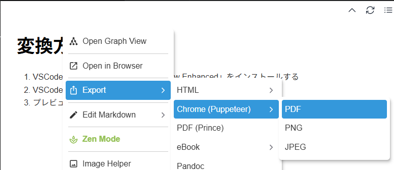

# 変換方法
1. VSCodeに拡張機能「Markdown Preview Enhanced」をインストールする
2. VSCodeで対象のMarkdownファイルをプレビューで開く
3. プレビュー画面を右クリック > Export > Chrome > PDF を押下する


---

# その他の変換方法について
## Pandoc
以下のコマンドでPDFへの変換を行ったところ、出力されたPDFは見にくかった。

```
pandoc 【研修生用】Snowflake研修プログラム_ハンドアウト.md -o 【研修生用】Snowflake研修プログラム_ハンドアウト.pdf --pdf-engine=typst -V mainfont="MS Gothic"
```

mdファイル中のHTMLタグには対応していないらしい。
また、markdown用cssを作成し、それを読み込ませる方法もあるようだったが、詳細調査できず。
