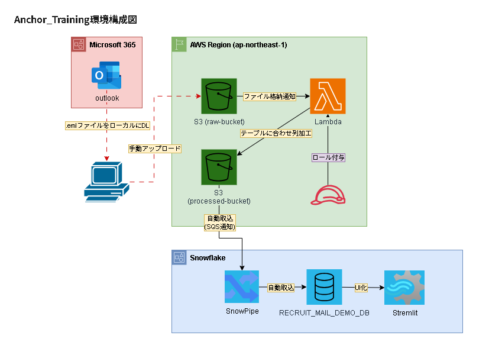
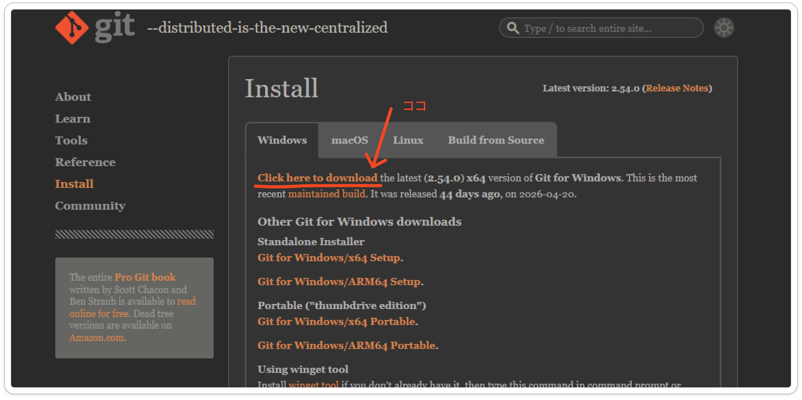
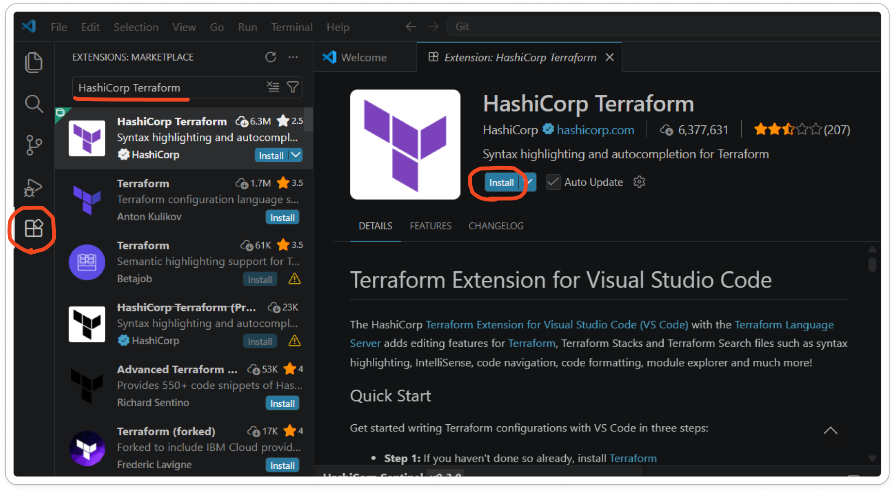
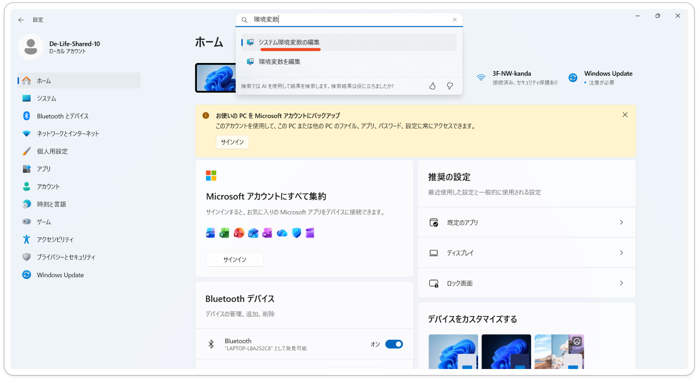
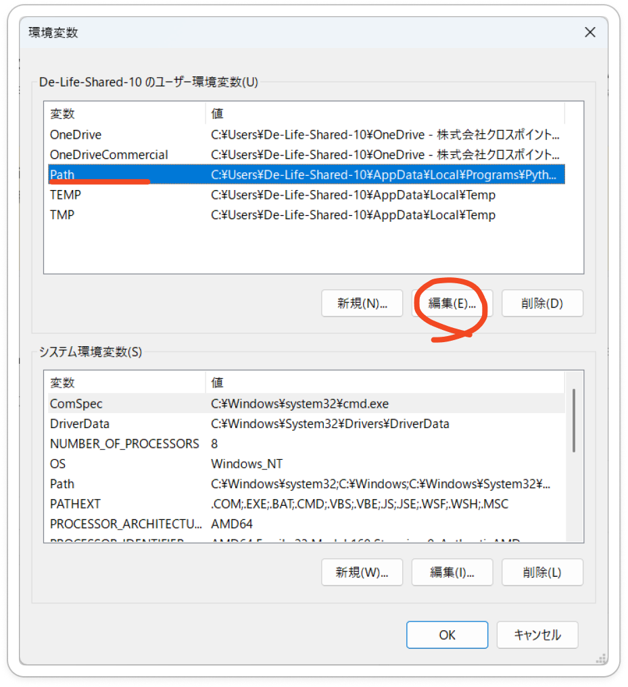

<div style="text-align:center;">
<p>【研修生用】</p>
<h1>Snowflake研修プログラム_ハンドアウト</h1>
<p>最終更新：2026/6/3</p>
</div>

<br>
<br>


# 研修概要

本研修の目的は、『Anchor』を模した簡易的なWebアプリケーションを作成することです。

Anchorとは、De-Lifeが社内開発した、営業向けWebアプリケーションです。Outlookに届いたメールを自動取得し、AWSおよびSnowflake上での加工を経て、Streamlit上での便利なメール検索を実現しています。

研修で作成するアプリでは、Outlookとの連携が手動に置き換えられ、AWSやSnowflake内の構成も非常にシンプルになっています。


<br>

# 研修の目的

AWS・Snowflakeの基礎技術を習得するとともに、スキルシートにも記載可能な実務経験を獲得すること。

<br>


# 対象者

- SnowPro Core資格保有者【必須】

- AWS SAA【推奨】

<br>


# 技術スタック

- Snowflake
  - SQL（CRUD操作）
  - RBACに基づくロール／権限管理
  - Stream、Task、Snowpipeによるデータパイプライン実装
  - Streamlit（python）

- AWS
  - CloudFormation（YAML）
  - IAM
  - S3
  - Lambda（python 3.14）

- その他
  - Terraform
  - dbt
  - Git
  - GitHub Actions
  - draw&#46;io（XML）

<br>


# 構成図



本番Anchorでは、Microsoft Graph APIとの連携／AWS ECSによるDocker環境の採用により、完全自動化されたプログラムを実現しています。

本研修で作成されるプログラムは、 Microsoft Graph API→S3への手動アップロード、AWS ECS→AWS Lambdaへと置き換え、ユーザーが明示的な操作を行った場合にのみ動作する仕組みとなっています。

複数のサービスを組み合わせて成り立つアプリケーションになるので、「今はどんな目的で、何の実装をしているのか？」を常に考えながら研修に臨むようにしてください。

<br>


# カリキュラム

1.  [アカウント払い出し申請（0.5h）](#chapter-1)

2.  [ローカル環境のセットアップ（1h）](#chapter-2)

3.  [概要レクチャー（1h）](#chapter-3)

4.  [構成図の作成（1.5h）](#chapter-4)

5.  [AWS環境構築（2h）](#chapter-5)

6.  [GitHub環境構築（2h）](#chapter-6)

7.  [Terraformによるsnowflakeオブジェクトの定義（4h）](#chapter-7)

8.  [dbtによるデータ加工（4h）](#chapter-8)

9.  [Streamlitアプリケーションの実装（1h）](#chapter-9)

10. [Snowflake内データパイプラインの実装（4h）](#chapter-10)

11. [レポート作成（1h）](#chapter-11)

※全5日の課程を想定。

<br>


<a id="chapter-1"></a>

## 1. アカウント払い出し申請（0.5h）

### 1-1. アカウント登録
GitHubおよび HCP Terraformのアカウント登録を行う。

### 1-2. アカウント申請
Teams（チャネル?）にて、研修アカウントの払い出し申請を行う。
その際、HCP TerraformとGitHubについて、以下のアカウント情報を添付すること。  

- HCP Terraform: メールアドレス
- Github: ユーザー名

### 1-3. 確認
管理者からアカウントの払い出しの通知を受け取る。
当該アカウントで各サービスにログインできることを確認する。

<br>


<a id="chapter-2"></a>

## 2.ローカル環境のセットアップ（1h）

### 1. Git/Git Bash

**DLリンク：** <https://git-scm.com/downloads/win>

インストーラーを実行し、デフォルト設定のままインストール。本書内ではBashでコマンドを記載していますので、「Git Bash Here」オプションを有効にしておくことを推奨します。



```bash
# インストール確認：
git --version
```

> [!Note]
> 赤字のエラーが表示されたら、インストールできていないか環境変数が未設定です。
>
> → 環境変数について（link）

<br>


### 2. VSCode

**DLリンク：** <https://code.visualstudio.com/>

インストーラーを実行し、デフォルト設定のままインストール。


<br>

### 3. HashiCorp Terraform（VSCode拡張機能）

VSCodeを起動し、以下の手順で導入：

左サイドバー \> 拡張機能アイコン \> 検索欄に「HashiCorp Terraform」と入力 \> インストール \> 有効化\


<br>

### 4. Terraform CLI

**DLリンク：** <https://developer.hashicorp.com/terraform/install>

1.  Windows用のzipファイルをダウンロード\
    

2.  zipを解凍し terraform.exe を取り出す

3.  任意のフォルダ（例：C:\terraform）に配置

4.  環境変数のPathに追加\
    \
    \
    

> [!Note]
> **参考【環境変数について】**：<https://qiita.com/x-rot/items/7a4ecab94f124f89f715>

```bash
# インストール確認：
terraform --version
```

<br>

### 5. Python 3.12

**DLリンク：** <https://www.python.org/downloads/windows/>\


インストーラーを実行。**インストール時に以下を必ず有効化すること：**

`☑ Add Python to PATH\`


```bash
# インストール確認：
python --version

# 必要パッケージのインストール：
pip install cryptography
pip install dbt-snowflake

# dbtインストール確認：
dbt --version
```

<br>

## 注意事項

・各ツールのインストール後はターミナルを再起動してから動作確認すること\
・**<u>Python 3.14はdbt-snowflakeに非対応のため必ず3.12を使用すること</u>**\
・Pathの設定が反映されない場合はPCを再起動すること

<br>

<a id="chapter-3"></a>

## 3. 概要レクチャー（1h）

担当管理者から口頭で研修の説明を受けます。ここでは要点のみ列記します。

- 研修の手順は以下の通りです。

  - 章単位で課題をクリアし、成果物を<span style="color:red;">指定のフォルダ</span>にアップロードすること。

  - 成果物のファイル名は「（氏名）\_（章番号）成果物」とすること。

  - 成果物のアップロードの報告義務は無い。ただし、全過程をクリアした際は、Teamsにて報告すること。

- 研修中の連絡は、以下の通りです。

  - <span style="color:red;">研修専用のTeamsチャネルで連絡を行う。研修生ごとに用意された個別スレッドを使用する</span>

- 研修上の注意点

  - 秘密鍵の取り扱い（GitHub、HCP Terraform）

  - Git関連

    - 利用ブランチはfeature/\<name\>

    - mainへのpushは不可

<br>

<a id="chapter-4"></a>
## 4. 構成図の作成（1.5h）

この章から、実際の研修がスタートします。

各章は＜手順概要＞＜課題＞＜解説＞の3節で構成されています。\
＜手順概要＞を読んでから＜課題＞に取り組み、できあがった成果物を指定のフォルダに格納してください。課題を終えたら、＜解説＞を確認して理解を深めましょう。

知らない概念やわからない言葉が出てきたら、<span style="color:blue;">『Snowflake研修リファレンス（作成中）』</span>を参照することをおすすめします。

では、本章の説明に入ります。

本章では、研修プログラムで作成するアプリケーションの構成図を作成します。\
構成図の作成にはdraw.ioを使用します。手動で一から作成することもできますが、ここではXMLによる作成手順を紹介します。


### ＜手順概要＞

- [こちら](.\drawIO_guideline_v2.1.json)から、構成図ガイドライン（.json）をダウンロードします。

- ChatGPTやClaudeなどのLLMに構成図ガイドラインを読み込ませ、そのガイドラインに沿って構成図用XMLを出力するように依頼します。どのような構成図を出力させるかの指示は、自身で考えてください。

- 出力されたXMLをdraw.ioにペーストします。

- 必要に応じて、手動で修正を加えます。


### ＜課題＞

概要レクチャーで知り得た情報を基に、本研修で作成するアプリケーションの構成図を作成してください。

### ＜解説＞

構成図例は以下の通りです。


<br>

<a id="chapter-5"></a>
## 5. AWS環境構築（2h）

本章では、AWS環境の構築を行います。

今回はCloudFormationを活用し、IaCによるリソース構築を実践します。作成するリソースはIAMロール、S3バケット、Lambda関数です。

この章以降、ダウンロードしたソースコードを編集することになりますが、**<u>ソースコードは意図的に不完全な状態になっています。そのまま実行しても正常に動作しないことにご留意ください。</u>**

### ＜手順概要＞

- 指定されたユーザーで、AWSコンソールにログインします。

- S3に格納されたテンプレートをダウンロードします。こちらがCloudFormationのテンプレートとなりますが、不完全な状態になっています。課題に沿って、このファイルをローカルで編集します。

- 完成したテンプレートを、任意のファイル名を変更した上で同フォルダに配置します。

- 当該テンプレートを指定して、CloudFormationでスタックを実行します。なお、スタック名は『<ユーザー名>-pipeline』としてください。
  
- 作成されたバケット『\<ユーザー名\>-bucket』の配下に、『raw_emails/』および『messages/』フォルダを作成してください。

- 生成されたリソースが意図通り機能するか、試験します。

### ＜課題＞

①CloudFormationを用いて、以下の要件を満たすようにAWSリソースを作成してください。

■要件

- 『\<ユーザー名\>-bucket』という名称のバケットを作成する。

- 同バケットに対して、作成者および以下に列挙する管理者が、任意の操作が可能である。

  - 'arn:aws:iam::875180007397:user/SHINJI_KUROSAKI'

  - 'arn:aws:iam::875180007397:user/TAKUYA_INOUE'

  - 'arn:aws:iam::875180007397:user/CHIHIRO_SHIRASAKA'

  - 'arn:aws:iam::875180007397:user/TAIGA_ISHII'

■テンプレート格納場所
[trainee/](https://ap-southeast-2.console.aws.amazon.com/s3/buckets/cloudformation-templates-mybucket?prefix=trainee/)


②Lambda関数が正常に機能するか、試験してください。『messages/』フォルダに加工済みのjsonlファイルが格納されていれば成功です。

### ＜解説＞

- ユーザー名
  - ユーザー名は、自身の使用しているtraineeユーザー名を入力してください。


- バケット名
  - AWSテンプレートにおいては、${パラメータ名}とすることで、Parametersで定義したパラメータを参照することができます。
  - 今回定義しているパラメータはTraineeUserNameなので、"${TraineeUserName}-bucket"と記述するのが正解です。


- バケットポリシーのPrincipal
  - AllowOwnerAccessの方では、自身のユーザーを指定します。ただし、ARNで指定する必要があるので、以下の通り記述するのが正解です。
    - 'arn:aws:iam::875180007397:user/${TraineeUserName}'
  - AllowAdminAccessの方は、問題文に記載されている4つのARNを指定します。


<br>

<a id="chapter-6"></a>

## 6. GitHub環境構築（2h）

本章では、GitHubの環境構築を実施します。\
本アプリケーションにおいてGithubは、CI/CDパイプラインの中核、およびdbtの実行環境として機能します。

### ＜手順概要＞

- [snowflake_training_for_traineeリポジトリ](https://github.com/ti2140/snowflake_training_for_trainee)を開き、リポジトリ内のファイルをローカルにダウンロードします。
- 自身のGitHubアカウントで新規リポジトリを作成し、ローカルにDLしたファイルをpushします。
- 新規ブランチを作成し、ソースコードの編集を行います。その後、リモートリポジトリにpushします。

### ＜課題＞

1. developブランチの直下に、『feature/\<名前\>』という名称でブランチを作成してください。以降、特別の断りがない限り、当該のブランチにて作業を行います。

2. README.mdを任意の内容に書き換え、変更内容をリモートにpushしてください。

### ＜解説＞

Githubのリポジトリページで作成したブランチに切り替えた後、README.mdの内容を確認してください。自身の変更内容が反映されていれば完了です。


<br>

<a id="chapter-7"></a>
## 7. TerraformによるSnowflakeオブジェクトの定義（4h）

本章では、HCP Terraformを使用してSnowflake上にオブジェクトを作成することを目指します。

> [!Note]
> HCP Terraformは、クラウドベースのTerraform実行環境です。環境変数の管理や、CI/CDパイプラインとの連携が可能です。
> 本アプリケーション中のTerraformは、HCP Terraform上で動作します。

### ＜手順概要＞

- ローカルにてTerraformソースコードを編集し、リモートにpushします。

- CI/CDパイプラインの実行、およびSnowflakeオブジェクトが作成されることを確認します。

### ＜課題＞

①『ci_cd.yml』を編集し、あなたが作業するブランチにpushおよびプルリクエストした際にワークフローが起動するよう、トリガーを変更してください。

②『schema&#46;.tf』を編集し、スキーマの名称を正しく設定してください。[オブジェクト一覧](#オブジェクト一覧)を参照のこと。

③『pipeline&#46;.tf』を編集し、パイプラインを定義するSQLクエリを正しく定義してください。 

④変更内容をリモートにpushし、CI/CDパイプラインがエラーなく動くかを確認してください。また、Snowflake上で今回定義したオブジェクトが生成されていることを確認してください。

### ＜解説＞

①  
- 作業ブランチ
  - 作業ブランチ名はfeature/<自身の名前>となっているはずなので、『feature/<自身の名前>』とするのが適切です。
- GitHub環境名
  - 正解は ${{ github.actor }}です。今回は環境名=GitHubユーザー名としているので、この書式が成り立ちます。環境名を任意で設定している場合は、静的に指定する必要があります。
- .tfファイルのディレクトリ
  - .tfファイルはterraformフォルダに配置されています。よって『terraform』が正解です。

②  
オブジェクト名一覧を参照すると、スキーマ名は『RAW』『NORMALIZED』であることがわかります。
  
③  
正しいクエリは以下の通りです。COPYキーワードにはINTOを伴います。各オブジェクトの変数名は、variables.tfを参照すれば確認することができます。  
```sql
COPY INTO ${snowflake_database.training_db.name}.${snowflake_schema.training_raw.name}.${snowflake_table.mails_raw.name}
  FROM @${snowflake_database.training_db.name}.${snowflake_schema.training_raw.name}.${snowflake_stage.st_s3_mail.name}
  MATCH_BY_COLUMN_NAME = CASE_INSENSITIVE
```


<br>

<a id="chapter-8"></a>
## 8. dbtによるデータ加工（4h）

本章では、dbtを用いてテーブルデータを加工し、Streamlitアプリケーションで参照するテーブルを作成することを目指します。

### ＜手順概要＞

- ローカルにてdbtソースコードを編集し、リモートにpushします。

- CI/CDパイプラインの実行、およびSnowflakeオブジェクトが作成されることを確認します。

- S3にメールファイルを手動アップロードし、パイプラインが意図通り機能するか確認してください。

### ＜課題＞

①『dbt_projebt.sql』を編集し、以下の要件を満たすようなテーブルを作成してください。

**【要件】**

- テーブル名はclassify_text_labelである。

- 列LABEL(文字列型)、DESCRIPTION(文字列型)、SORT_ORDER(整数型)を持つ。

②『mails_normalized.sql』を編集し、MAILS_NORMLIZEDテーブルを適切に定義してください。

②変更内容をリモートにpushし、I/CDパイプラインがエラーなく動くかを確認してください。また、Snowflake上で今回定義したオブジェクトが生成されていることを確認してください。

④5章で作成した『\<ユーザー名\>-bucket』の『raw_emails/』フォルダに.emlファイルをアップロードし、 MAILS_NORMALIZEDテーブルに自動反映されることを確認してください。

### ＜解説＞

①  
模範解答は以下の通りです。SORT_ORDERの型はintegerを指定するのが適切です。
```yaml
seeds:
  mydbt:
    classify_text_labels:
      +schema: NORMALIZED
      +column_types:
        LABEL: varchar
        DESCRIPTION: varchar
        SORT_ORDER: integer
```

②  
模範解答は以下の通りです。SUBJECTの列名はファイル上部に記載のCTEを参照してください。  
FLOAT値であるSENTIMENT関数の戻り値を文字列に変換するには、CASE句で判定するのが適切です。

```sql
SELECT
    MESSAGE_ID,
    SUBJECT,
    FROM_EMAIL,
    RECEIVED_AT,
    TRUE AS AI_PROCESSED,
    summary AS AI_SUMMARY,
    CASE
        WHEN category_raw NOT IN (
            SELECT LABEL FROM {{ this.database }}.NORMALIZED.CLASSIFY_TEXT_LABELS
        ) THEN 'その他'
        ELSE category_raw
    END AS AI_CATEGORY,
    CASE
        WHEN sentiment_score > 0.3 THEN 'positive'
        WHEN sentiment_score < -0.3 THEN 'negative'
        ELSE 'neutral'
    END AS AI_SENTIMENT,
    keywords AS AI_KEYWORDS,
    OBJECT_CONSTRUCT(
        'summary', summary,
        'category', category_raw,
        'sentiment_score', sentiment_score,
        'keywords', keywords
    ) AS AI_RAW_RESULT,
    CURRENT_TIMESTAMP() AS NORMALIZED_AT
FROM ai_processed
```
<br>

<a id="chapter-9"></a>
## 9. Streamlitアプリケーションの実装（1h）

本章では、既存のStreamlitアプリケーションを複製し、pythonコードの編集によりアプリのビューを編集します。 
研修で作成したMAILS_NORMALIZEDテーブルを参照させることがゴールです。

### ＜手順概要＞
- Streamlitアプリケーションを開き、demo_applicationを複製します。

- 複製したアプリケーションのソースコードを直接編集し、参照先を切り替えます。

### ＜課題＞
①  
アプリケーションの参照元を、研修で作成したテーブルMAILS_NORMALIZEDに変更してください。  
その後、アプリ上で同テーブルのレコードが表示できることを確認してください。

②
詳細表示中のAI生出力（デバッグ用）ブロックを、非表示にしてください。

### 

### ＜解説＞
①  
参照元テーブルは、ソースコードの冒頭で定義されています。  
DB_NAMEの値を自身のデータベース名に変更することで、参照元を変更できます。

②  
以下のコードブロックをコメントアウトすることで、該当のブロックを非表示にできます。
```
with st.expander("AI生出力（デバッグ用）", expanded=False):
    ai_raw = row.get("AI_RAW_RESULT")
    if ai_raw:
        try:
            parsed = json.loads(str(ai_raw)) if isinstance(ai_raw, str) else ai_raw
            st.json(parsed)
        except Exception:
            st.code(str(ai_raw), language=None)
    else:
        st.write("（なし）")
```

<br>

<a id="chapter-10"></a>

## 10. Snowflake内データパイプラインの実装（4h）

### ＜内容＞

> 準備中

<br>

<a id="chapter-11"></a>

## 11. レポート作成（1h）

### ＜手順概要＞

- [こちら](TODO)からレポート用テンプレートをダウンロードします。

- レポートを作成し、[こちら](TODO)に提出します。

### ＜課題＞

- テンプレートに沿ったレポートを作成し、提出してください。

<br>

---

<br>

# オブジェクト一覧

| **種別** | **オブジェクト名** | **役割** |
|----|----|----|
| DATABASE | \<NAME\>\_TRAINING_DB | 研修生ごとの専用DB。本番環境と完全分離。 |
| SCHEMA | RAW | S3から取り込んだメールの生データを保持するスキーマ。 |
| SCHEMA | NORMALIZED | 加工・正規化済みデータを保持するスキーマ。 |
| TABLE | RAW.MAILS_RAW | Snowpipeで取り込んだメール生データの格納先。 |
| TABLE | NORMALIZED.MAILS_NORMALIZED | Streamlitの参照元。TASKによる加工済みデータを格納。 |
| INTEGRATION | S3_INT | SnowflakeとS3バケット間のストレージ連携設定。IAMロールと紐づける。 |
| STAGE | RAW.ST_S3_MAIL | S3上のメールJSONLファイルを参照するための外部ステージ。 |
| PIPE | RAW.PIPE_S3_TO_MAILS_RAW | STAGEのファイルをMAILS_RAWへ自動ロードするSnowpipe。 |
| TASK | RAW.T_TRANSFORM_TO_NORMALIZED | MAILS_RAWのデータを加工し、MAILS_PROCESSEDへ書き込む定期タスク。 |
| PROCEDURE | NORMALIZED.SP_AI_SUMMARIZE | Snowflake CortexによるAI要約処理を実行するストアドプロシージャ。 |
| ROLE | FR_ANCHOR_DEMO_ROLE | 研修生に付与する既存ロール。研修DB内の操作権限を管理。 |
| USER | SVC_TERRAFORM | Terraformによるインフラ構築用サービスアカウント。 |
| USER | SVC_DBT | dbtによるクエリ実行用サービスアカウント。 |

<br>

# FR_ANCHOR_DEMO_ROLEの権限（調整中）

| **対象** | **権限** | **用途** |
|----|----|----|
| DATABASE \<NAME\>\_TRAINING_DB | USAGE | DB内オブジェクトへのアクセス基盤 |
| SCHEMA \<NAME\>\_TRAINING_DB.RAW | USAGE | スキーマ内オブジェクトへのアクセス基盤 |
| SCHEMA \<NAME\>\_TRAINING_DB.RAW | MODIFY | スキーマ設定変更 |
| SCHEMA \<NAME\>\_TRAINING_DB.RAW | MONITOR | スキーマ使用状況の確認 |
| SCHEMA \<NAME\>\_TRAINING_DB.RAW | CREATE TABLE | MAILS_RAW作成 |
| SCHEMA \<NAME\>\_TRAINING_DB.RAW | CREATE STAGE | ST_S3_MAIL作成 |
| SCHEMA \<NAME\>\_TRAINING_DB.RAW | CREATE PIPE | PIPE_S3_TO_MAILS_RAW作成 |
| SCHEMA \<NAME\>\_TRAINING_DB.RAW | CREATE TASK | T_TRANSFORM_TO_NORMALIZED作成 |
| SCHEMA \<NAME\>\_TRAINING_DB.RAW | CREATE FILE FORMAT | ファイルフォーマット定義 |
| SCHEMA \<NAME\>\_TRAINING_DB.RAW | CREATE STREAM | ストリーム作成 |
| SCHEMA \<NAME\>\_TRAINING_DB.RAW | CREATE VIEW | ビュー作成 |
| SCHEMA \<NAME\>\_TRAINING_DB.NORMALIZED | USAGE | スキーマ内オブジェクトへのアクセス基盤 |
| SCHEMA \<NAME\>\_TRAINING_DB.NORMALIZED | MODIFY | スキーマ設定変更 |
| SCHEMA \<NAME\>\_TRAINING_DB.NORMALIZED | MONITOR | スキーマ使用状況の確認 |
| SCHEMA \<NAME\>\_TRAINING_DB.NORMALIZED | CREATE TABLE | MAILS_PROCESSED作成 |
| SCHEMA \<NAME\>\_TRAINING_DB.NORMALIZED | CREATE PROCEDURE | SP_AI_SUMMARIZE作成 |
| SCHEMA \<NAME\>\_TRAINING_DB.NORMALIZED | CREATE VIEW | ビュー作成 |
| SCHEMA \<NAME\>\_TRAINING_DB.NORMALIZED | CREATE STREAMLIT | Streamlitアプリ作成 |
| SCHEMA \<NAME\>\_TRAINING_DB.NORMALIZED | CREATE STREAM | ストリーム作成 |
| SCHEMA \<NAME\>\_TRAINING_DB.NORMALIZED | CREATE TASK | タスク作成 |
| WAREHOUSE SNOWFLAKE_LEARNING_WH | USAGE | クエリ実行用ウェアハウスの使用 |
| ACCOUNT | EXECUTE TASK | TASKの実行（アカウントレベル権限） |
